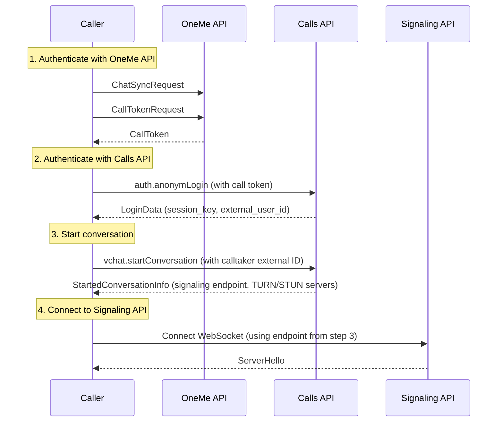

# Calls API Documentation

## Table of Contents

- [Overview](#overview)
- [Authentication](#authentication)
- [Request Format](#request-format)
  - [Base Parameters](#base-parameters)
  - [Response Format](#response-format)
- [Methods](#methods)
  - [auth.anonymLogin](#authanonymlogin)
  - [vchat.startConversation](#vchatstartconversation)
- [Complete Call Initiation Workflow](#complete-call-initiation-workflow)
- [Error Handling](#error-handling)
  - [Common Errors](#common-errors)
  - [Error Handling Best Practices](#error-handling-best-practices)
- [Notes](#notes)

## Overview

The Calls API is an HTTP-based service used for call session management in the MAX messenger. It handles user authentication for call sessions and initiates call conversations.

**Endpoint:** `https://calls.okcdn.ru/fb.do`

**Method:** HTTP POST (application/x-www-form-urlencoded)

## Authentication

All requests to the Calls API require an application key:

**Application Key:** `CNHIJPLGDIHBABABA`

This key must be included in every request as a form parameter.

## Request Format

All requests are sent as HTTP POST requests with `Content-Type: application/x-www-form-urlencoded`.

### Base Parameters

Every request must include these base parameters:

| Parameter | Type | Required | Description |
|-----------|------|----------|-------------|
| `method` | string | Yes | The API method to call |
| `format` | string | Yes | Response format (always `"JSON"`) |
| `application_key` | string | Yes | Application key (always `"CNHIJPLGDIHBABABA"`) |

### Response Format

All responses are returned as JSON objects.

## Methods

### auth.anonymLogin

Authenticate a user session for the Calls API using a call token obtained from the OneMe API.

**Method:** `auth.anonymLogin`

**Request Parameters:**

| Parameter | Type | Required | Description |
|-----------|------|----------|-------------|
| `method` | string | Yes | Must be `"auth.anonymLogin"` |
| `format` | string | Yes | Must be `"JSON"` |
| `application_key` | string | Yes | Must be `"CNHIJPLGDIHBABABA"` |
| `session_data` | string (JSON) | Yes | JSON-encoded session data (see below) |

**Session Data Structure:**

The `session_data` parameter must be a JSON-encoded string containing:

```json
{
  "auth_token": "call_token_from_OneMe_API",
  "client_type": "SDK_JS",
  "client_version": "1.1",
  "device_id": "550e8400-e29b-41d4-a716-446655440000",
  "version": 3
}
```

**Session Data Fields:**

| Field | Type | Required | Description |
|-------|------|----------|-------------|
| `auth_token` | string | Yes | Call token obtained from OneMe API `CallTokenRequest` |
| `client_type` | string | Yes | Client type identifier (always `"SDK_JS"`) |
| `client_version` | string | Yes | Client version (always `"1.1"`) |
| `device_id` | string (UUID) | Yes | Unique device identifier (generate a new UUID) |
| `version` | integer | Yes | Session data version (always `3`) |

**Response:**

```json
{
  "uid": "user_internal_id",
  "session_key": "session_key_string",
  "session_secret_key": "session_secret_key_string",
  "api_server": "api_server_url",
  "external_user_id": "external_user_id_string"
}
```

**Response Fields:**

| Field | Type | Description |
|-------|------|-------------|
| `uid` | string | Internal user ID for this session |
| `session_key` | string | Session key used for authenticated requests |
| `session_secret_key` | string | Session secret key (may be used for additional security) |
| `api_server` | string | API server URL (may be used for additional API calls) |
| `external_user_id` | string | External user ID (used to identify users in call conversations) |

**Example Request:**

```bash
curl -X POST https://calls.okcdn.ru/fb.do \
  -d "method=auth.anonymLogin" \
  -d "format=JSON" \
  -d "application_key=CNHIJPLGDIHBABABA" \
  -d "session_data={\"auth_token\":\"call_api_token_abc123xyz\",\"client_type\":\"SDK_JS\",\"client_version\":\"1.1\",\"device_id\":\"550e8400-e29b-41d4-a716-446655440000\",\"version\":3}"
```

**Example Response:**

```json
{
  "uid": "123456789",
  "session_key": "session_key_abc123",
  "session_secret_key": "session_secret_xyz789",
  "api_server": "https://api-server.example.com",
  "external_user_id": "987654321"
}
```

---

### vchat.startConversation

Start a new call conversation. This method initiates a call session and returns signaling server connection information.

**Method:** `vchat.startConversation`

**Request Parameters:**

| Parameter | Type | Required | Description |
|-----------|------|----------|-------------|
| `method` | string | Yes | Must be `"vchat.startConversation"` |
| `format` | string | Yes | Must be `"JSON"` |
| `application_key` | string | Yes | Must be `"CNHIJPLGDIHBABABA"` |
| `session_key` | string | Yes | Session key from `auth.anonymLogin` response |
| `conversationId` | string (UUID) | Yes | Unique conversation identifier (generate a new UUID) |
| `isVideo` | string | Yes | Whether this is a video call (`"true"` or `"false"`) |
| `protocolVersion` | string | Yes | Protocol version (always `"5"`) |
| `externalIds` | string | Yes | External user ID of the call recipient (calltaker) |
| `payload` | string (JSON) | Yes | JSON-encoded payload data (see below) |

**Payload Structure:**

The `payload` parameter must be a JSON-encoded string containing:

```json
{
  "is_video": false
}
```

**Payload Fields:**

| Field | Type | Required | Description |
|-------|------|----------|-------------|
| `is_video` | boolean | Yes | Whether this is a video call (typically `false` for audio-only calls) |

**Response:**

```json
{
  "turn_server": {
    "urls": [
      "turn:turn-server1.example.com:3478",
      "turn:turn-server2.example.com:3478"
    ],
    "username": "turn_username",
    "credential": "turn_password"
  },
  "stun_server": {
    "urls": [
      "stun:stun-server.example.com:3478"
    ]
  },
  "endpoint": "wss://signaling-server.example.com/websocket?param1=value1&param2=value2"
}
```

**Response Fields:**

| Field | Type | Description |
|-------|------|-------------|
| `turn_server` | object | TURN server configuration for media relay |
| `turn_server.urls` | array of strings | Array of TURN server URLs |
| `turn_server.username` | string | TURN server username |
| `turn_server.credential` | string | TURN server password |
| `stun_server` | object | STUN server configuration for NAT traversal |
| `stun_server.urls` | array of strings | Array of STUN server URLs |
| `endpoint` | string | WebSocket endpoint URL for the Signaling API. This URL includes query parameters and should be used to connect to the signaling server |

**Example Request:**

```bash
curl -X POST https://calls.okcdn.ru/fb.do \
  -d "method=vchat.startConversation" \
  -d "format=JSON" \
  -d "application_key=CNHIJPLGDIHBABABA" \
  -d "session_key=session_key_abc123" \
  -d "conversationId=550e8400-e29b-41d4-a716-446655440000" \
  -d "isVideo=false" \
  -d "protocolVersion=5" \
  -d "externalIds=987654321" \
  -d "payload={\"is_video\":false}"
```

**Example Response:**

```json
{
  "turn_server": {
    "urls": [
      "turn:turn1.example.com:3478",
      "turn:turn2.example.com:3478"
    ],
    "username": "user123",
    "credential": "pass456"
  },
  "stun_server": {
    "urls": [
      "stun:stun.example.com:3478"
    ]
  },
  "endpoint": "wss://signaling.example.com/websocket?userId=123456789&entityType=USER&conversationId=550e8400-e29b-41d4-a716-446655440000&token=signaling_token_xyz"
}
```

## Complete Call Initiation Workflow

Here is a complete example of initiating a call:



**Step-by-step:**

1. **Obtain call token** from OneMe API:
   - Call `ChatSyncRequest` with login token
   - Call `CallTokenRequest` to get call token

2. **Authenticate with Calls API**:
   - Call `auth.anonymLogin` with call token
   - Save `session_key` and `external_user_id` from response

3. **Start conversation**:
   - Generate a new UUID for `conversationId`
   - Call `vchat.startConversation` with:
     - `session_key` from step 2
     - `conversationId` (new UUID)
     - `externalIds` (calltaker's external user ID)
     - `isVideo` set to `"false"` for audio-only calls
     - `protocolVersion` set to `"5"`
     - `payload` with `{"is_video": false}`

4. **Extract signaling endpoint**:
   - Use the `endpoint` field from the response
   - This endpoint is ready to use for Signaling API connection

5. **Connect to Signaling API**:
   - Use the endpoint URL to establish WebSocket connection
   - See Signaling API documentation for connection details
