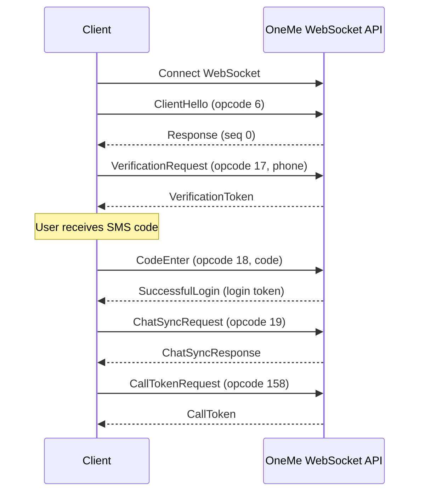

# OneMe API Documentation

## Table of Contents

- [Overview](#overview)
- [Connection](#connection)
  - [WebSocket Connection](#websocket-connection)
  - [Connection Example](#connection-example)
- [Message Format](#message-format)
  - [Message Fields](#message-fields)
  - [Sequence Numbers](#sequence-numbers)
  - [Error Handling](#error-handling)
- [Methods](#methods)
  - [ClientHello](#clienthello)
  - [VerificationRequest](#verificationrequest)
  - [CodeEnter](#codeenter)
  - [ChatSyncRequest](#chatsyncrequest)
  - [CallTokenRequest](#calltokenrequest)
  - [WaitForIncomingCall](#waitforincomingcall)
- [Complete Authentication Workflow](#complete-authentication-workflow)
- [Error Handling](#error-handling-1)
  - [Common Errors](#common-errors)
  - [Error Handling Best Practices](#error-handling-best-practices)
- [Notes](#notes)

## Overview

The OneMe API is a WebSocket-based service used for authentication and call management in the MAX messenger. It handles user authentication, chat synchronization, call token requests, and incoming call notifications.

**Endpoint:** `wss://ws-api.oneme.ru/websocket`

## Connection

### WebSocket Connection

To establish a connection to the OneMe API, you must:

1. Connect to the WebSocket endpoint: `wss://ws-api.oneme.ru/websocket`
2. Set the `Origin` header to `https://web.max.ru`

## Message Format

All messages sent to and received from the OneMe API follow a consistent structure:

```json
{
  "seq": 0,
  "opcode": 6,
  "payload": { ... },
  "ver": 11,
  "cmd": 0
}
```

### Message Fields

| Field     | Type    | Description                                                                                     |
|-----------|---------|-------------------------------------------------------------------------------------------------|
| `seq`     | integer | Sequence number for request/response matching. Starts at 0 and increments for each sent message |
| `opcode`  | integer | Operation code identifying the message type                                                     |
| `payload` | object  | Message-specific payload data                                                                   |
| `ver`     | integer | Protocol version (always `11`)                                                                  |
| `cmd`     | integer | Message side: `0` for request, `1` for response                                                 |

### Sequence Numbers

- Sequence numbers start at `0` and increment for each message sent by the client
- When sending a message, store the sequence number to match it with the corresponding response
- Responses will have the same `seq` value as the request

### Error Handling

If an error occurs, the server will respond with an error in the payload:

```json
{
  "seq": 0,
  "opcode": 6,
  "payload": {
    "error": "Error message description"
  },
  "ver": 11,
  "cmd": 1
}
```

## Methods

### ClientHello

Initial handshake message that must be sent immediately after establishing the WebSocket connection.

**Opcode:** `6`

**Request Payload:**

```json
{
  "userAgent": {
    "deviceType": "WEB",
    "locale": "ru",
    "deviceLocale": "ru",
    "osVersion": "Windows",
    "deviceName": "Chrome",
    "headerUserAgent": "Mozilla/5.0 (Windows NT 10.0; Win64; x64) AppleWebKit/537.36 (KHTML, like Gecko) Chrome/142.0.0.0 Safari/537.36",
    "appVersion": "25.11.2",
    "screen": "1080x1920 1.0x",
    "timezone": "Europe/Moscow"
  },
  "deviceId": "550e8400-e29b-41d4-a716-446655440000"
}
```

**Request Fields:**

| Field                       | Type          | Required | Description                        |
|-----------------------------|---------------|----------|------------------------------------|
| `userAgent.deviceType`      | string        | Yes      | Device type (e.g., `"WEB"`)        |
| `userAgent.locale`          | string        | Yes      | User locale (e.g., `"ru"`)         |
| `userAgent.deviceLocale`    | string        | Yes      | Device locale (e.g., `"ru"`)       |
| `userAgent.osVersion`       | string        | Yes      | Operating system version           |
| `userAgent.deviceName`      | string        | Yes      | Device name (e.g., `"Chrome"`)     |
| `userAgent.headerUserAgent` | string        | Yes      | Full User-Agent string             |
| `userAgent.appVersion`      | string        | Yes      | Application version                |
| `userAgent.screen`          | string        | Yes      | Screen resolution and scale        |
| `userAgent.timezone`        | string        | Yes      | Timezone (e.g., `"Europe/Moscow"`) |
| `deviceId`                  | string (UUID) | Yes      | Unique device identifier           |

**Response:**

The server responds with an empty payload or a success acknowledgment.

**Example Request:**

```json
{
  "seq": 0,
  "opcode": 6,
  "payload": {
    "userAgent": {
      "deviceType": "WEB",
      "locale": "ru",
      "deviceLocale": "ru",
      "osVersion": "Windows",
      "deviceName": "Chrome",
      "headerUserAgent": "Mozilla/5.0 (Windows NT 10.0; Win64; x64) AppleWebKit/537.36",
      "appVersion": "25.11.2",
      "screen": "1080x1920 1.0x",
      "timezone": "Europe/Moscow"
    },
    "deviceId": "550e8400-e29b-41d4-a716-446655440000"
  },
  "ver": 11,
  "cmd": 0
}
```

---

### VerificationRequest

Request an SMS verification code for phone number authentication.

**Opcode:** `17`

**Request Payload:**

```json
{
  "phone": "+79991234567",
  "type": "START_AUTH",
  "language": "ru"
}
```

**Request Fields:**

| Field      | Type   | Required | Description                                               |
|------------|--------|----------|-----------------------------------------------------------|
| `phone`    | string | Yes      | Phone number in format `+7XXXXXXXXXX` (with country code) |
| `type`     | string | Yes      | Authentication type (always `"START_AUTH"`)               |
| `language` | string | Yes      | Language code (e.g., `"ru"`)                              |

**Response Payload:**

```json
{
  "token": "verification_token_string"
}
```

**Response Fields:**

| Field   | Type   | Description                                          |
|---------|--------|------------------------------------------------------|
| `token` | string | Verification token to be used in `CodeEnter` request |

**Example Exchange:**

**Request:**
```json
{
  "seq": 1,
  "opcode": 17,
  "payload": {
    "phone": "+79991234567",
    "type": "START_AUTH",
    "language": "ru"
  },
  "ver": 11,
  "cmd": 0
}
```

**Response:**
```json
{
  "seq": 1,
  "opcode": 17,
  "payload": {
    "token": "abc123verificationtoken456"
  },
  "ver": 11,
  "cmd": 1
}
```

---

### CodeEnter

Submit the SMS verification code to complete authentication.

**Opcode:** `18`

**Request Payload:**

```json
{
  "token": "verification_token_from_VerificationRequest",
  "verifyCode": "123456",
  "authTokenType": "CHECK_CODE"
}
```

**Request Fields:**

| Field           | Type   | Required | Description                                            |
|-----------------|--------|----------|--------------------------------------------------------|
| `token`         | string | Yes      | Verification token received from `VerificationRequest` |
| `verifyCode`    | string | Yes      | SMS verification code (typically 6 digits)             |
| `authTokenType` | string | Yes      | Authentication token type (always `"CHECK_CODE"`)      |

**Response Payload:**

```json
{
  "tokenAttrs": {
    "LOGIN": {
      "token": "login_token_string"
    }
  }
}
```

**Response Fields:**

| Field                    | Type   | Description                                                                  |
|--------------------------|--------|------------------------------------------------------------------------------|
| `tokenAttrs.LOGIN.token` | string | Login token for authenticated sessions. Save this token for future API calls |

**Example Exchange:**

**Request:**
```json
{
  "seq": 2,
  "opcode": 18,
  "payload": {
    "token": "abc123verificationtoken456",
    "verifyCode": "123456",
    "authTokenType": "CHECK_CODE"
  },
  "ver": 11,
  "cmd": 0
}
```

**Response:**
```json
{
  "seq": 2,
  "opcode": 18,
  "payload": {
    "tokenAttrs": {
      "LOGIN": {
        "token": "eyJhbGciOiJIUzI1NiIsInR5cCI6IkpXVCJ9..."
      }
    }
  },
  "ver": 11,
  "cmd": 1
}
```

---

### ChatSyncRequest

Synchronize chat data and authenticate. This method must be called before requesting a call token.

**Opcode:** `19`

**Request Payload:**

```json
{
  "token": "login_token_from_CodeEnter",
  "interactive": false,
  "chatsCount": 40,
  "chatsSync": 0,
  "contactsSync": 0,
  "presenceSync": 0,
  "draftsSync": 0
}
```

**Request Fields:**

| Field          | Type    | Required | Description                                             |
|----------------|---------|----------|---------------------------------------------------------|
| `token`        | string  | Yes      | Login token from `CodeEnter` response                   |
| `interactive`  | boolean | Yes      | Whether this is an interactive sync (typically `false`) |
| `chatsCount`   | integer | Yes      | Number of chats to sync (typically `40`)                |
| `chatsSync`    | integer | Yes      | Chats sync offset (typically `0`)                       |
| `contactsSync` | integer | Yes      | Contacts sync offset (typically `0`)                    |
| `presenceSync` | integer | Yes      | Presence sync offset (typically `0`)                    |
| `draftsSync`   | integer | Yes      | Drafts sync offset (typically `0`)                      |

**Response Payload:**

```json
{
  "token": "optional_token_string"
}
```

**Response Fields:**

| Field   | Type              | Description                    |
|---------|-------------------|--------------------------------|
| `token` | string (optional) | Optional token, may be omitted |

**Example Exchange:**

**Request:**
```json
{
  "seq": 3,
  "opcode": 19,
  "payload": {
    "token": "eyJhbGciOiJIUzI1NiIsInR5cCI6IkpXVCJ9...",
    "interactive": false,
    "chatsCount": 40,
    "chatsSync": 0,
    "contactsSync": 0,
    "presenceSync": 0,
    "draftsSync": 0
  },
  "ver": 11,
  "cmd": 0
}
```

**Response:**
```json
{
  "seq": 3,
  "opcode": 19,
  "payload": {
    "token": null
  },
  "ver": 11,
  "cmd": 1
}
```

---

### CallTokenRequest

Request a token for the Calls API. This token is required to authenticate with the Calls API service.

**Opcode:** `158`

**Request Payload:**

```json
{}
```

**Request Fields:**

None (empty object)

**Response Payload:**

```json
{
  "token": "call_token_string"
}
```

**Response Fields:**

| Field   | Type   | Description                                   |
|---------|--------|-----------------------------------------------|
| `token` | string | Token to be used for Calls API authentication |

**Example Exchange:**

**Request:**
```json
{
  "seq": 4,
  "opcode": 158,
  "payload": {},
  "ver": 11,
  "cmd": 0
}
```

**Response:**
```json
{
  "seq": 4,
  "opcode": 158,
  "payload": {
    "token": "call_api_token_abc123xyz"
  },
  "ver": 11,
  "cmd": 1
}
```

---

### WaitForIncomingCall

Listen for incoming call notifications. This method continuously listens for incoming call events.

**Opcode:** `137` (server-initiated, not a request opcode)

**Note:** This is not a request method. Instead, you should continuously read messages from the WebSocket connection and filter for messages with `opcode: 137`.

**Incoming Call Message:**

When an incoming call is received, the server will send a message with the following structure:

```json
{
  "seq": 5,
  "opcode": 137,
  "payload": {
    "vcp": "12345:base64compresseddata...",
    "callerId": 12345678,
    "conversationId": "550e8400-e29b-41d4-a716-446655440000"
  },
  "ver": 11,
  "cmd": 1
}
```

**Payload Fields:**

| Field            | Type          | Description                                                                                                    |
|------------------|---------------|----------------------------------------------------------------------------------------------------------------|
| `vcp`            | string        | Compressed and base64-encoded call configuration data. Contains signaling server URL, token, STUN/TURN servers |
| `callerId`       | integer       | External ID of the caller                                                                                      |
| `conversationId` | string (UUID) | Unique conversation identifier                                                                                 |

**VCP Decoding:**

The `vcp` field contains compressed call configuration. It must be decoded to extract:

- Signaling server URL and token
- STUN server address
- TURN server addresses, username, and password

The format is: `{uncompressed_size}:{base64_compressed_data}`

After decoding, the structure contains:

```json
{
  "tkn": "signaling_token",
  "wse": "wss://signaling-server-url",
  "stne": "stun:stun-server:port",
  "trne": "turn:turn-server1:port,turn:turn-server2:port",
  "trnu": "turn_username",
  "trnp": "turn_password"
}
```

**Example Incoming Call Message:**

```json
{
  "seq": 5,
  "opcode": 137,
  "payload": {
    "vcp": "1024:KLJSDHFKJHSDFKJHSDFKJHSDF...",
    "callerId": 12345678,
    "conversationId": "550e8400-e29b-41d4-a716-446655440000"
  },
  "ver": 11,
  "cmd": 1
}
```

## Complete Authentication Workflow

Here is a complete example of the authentication workflow:



**Step-by-step:**

1. **Connect** to `wss://ws-api.oneme.ru/websocket` with `Origin: https://web.max.ru`
2. **Send ClientHello** (opcode 6) after connection
3. **Request verification** by sending `VerificationRequest` (opcode 17) with phone number
4. **Receive SMS code** on the provided phone number
5. **Submit code** by sending `CodeEnter` (opcode 18) with verification token and SMS code
6. **Save login token** from the response (`tokenAttrs.LOGIN.token`)
7. **Sync chat** by sending `ChatSyncRequest` (opcode 19) with login token
8. **Request call token** by sending `CallTokenRequest` (opcode 158)
9. **Use call token** for Calls API authentication
