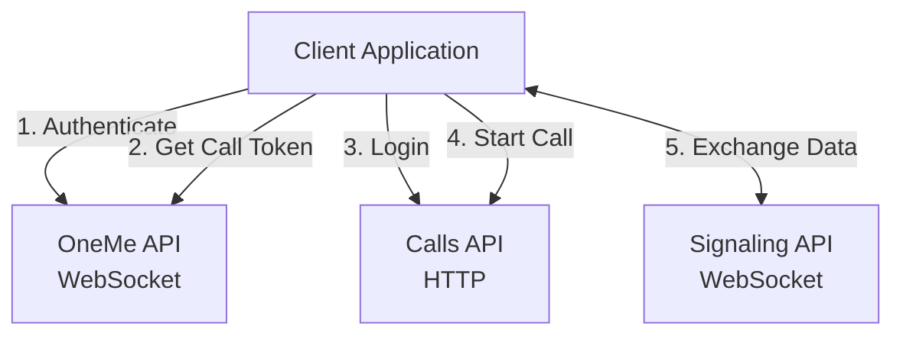

# Quick Start Guide

## Table of Contents

- [Overview](#overview)
- [Architecture](#architecture)
- [OneMe API](#oneme-api)
  - [Messages](#messages)
- [Calls API](#calls-api)
  - [Methods](#methods)
- [Signaling API](#signaling-api)
  - [Messages](#messages-1)
- [Call Workflows](#call-workflows)
  - [Making a Call (Caller)](#making-a-call-caller)
  - [Receiving a Call (Calltaker)](#receiving-a-call-calltaker)
- [Documentation](#documentation)

## Overview

The MAX Calls API consists of three main services that work together to enable voice and video calls:

1. **OneMe API** - WebSocket service for authentication and call notifications
2. **Calls API** - HTTP service for call session management
3. **Signaling API** - WebSocket service for real-time call signaling

## Architecture

## OneMe API

WebSocket-based service for authentication and call management.

**Endpoint:** `wss://ws-api.oneme.ru/websocket`

### Messages

- **[ClientHello](oneme.md#clienthello)** (opcode 6) - Initial handshake message sent immediately after WebSocket connection. Establishes client identity and device information.

- **[VerificationRequest](oneme.md#verificationrequest)** (opcode 17) - Request SMS verification code for phone number authentication. Requires phone number in international format.

- **[CodeEnter](oneme.md#codeenter)** (opcode 18) - Submit SMS verification code to complete authentication. Returns login token for authenticated sessions.

- **[ChatSyncRequest](oneme.md#chatsyncrequest)** (opcode 19) - Synchronize chat data. Required before requesting call token. Prepares the session for call operations.

- **[CallTokenRequest](oneme.md#calltokenrequest)** (opcode 158) - Request a token for Calls API authentication. Returns call token that is used to authenticate with Calls API.

- **[WaitForIncomingCall](oneme.md#waitforincomingcall)** (opcode 137) - Listen for incoming call notifications. Server-initiated message containing call configuration data including signaling server details.

## Calls API

HTTP-based service for call session management.

**Endpoint:** `https://calls.okcdn.ru/fb.do`

**Method:** HTTP POST (form-encoded)

### Methods

- **[auth.anonymLogin](calls.md#authanonymlogin)** - Authenticate a user session using call token from OneMe API. Returns session key and external user ID required for call operations.

- **[vchat.startConversation](calls.md#vchatstartconversation)** - Start a new call conversation. Initiates a call session and returns signaling server connection information including WebSocket endpoint, TURN, and STUN server configurations.

## Signaling API

WebSocket-based service for real-time call signaling during active calls.

**Endpoint:** Dynamic (provided by Calls API or extracted from OneMe API incoming call data)

### Messages

- **ServerHello** - First message received after WebSocket connection. Contains conversation information and participant IDs mapped to external user IDs.

- **AcceptCall** - Accept an incoming call. Sent by call recipient (calltaker) to accept the call with media settings configuration.

- **TransmitData** - Send data to another participant during an active call. Used for custom data transmission between call participants.

- **transmitted-data** notification - Receive data from another participant. Notification message containing data sent by the other participant.

- **Ping/Pong** - Heartbeat mechanism to keep WebSocket connection alive. Server sends "ping", client responds with "pong".

## Call Workflows

### Making a Call (Caller)

1. Connect to OneMe API and authenticate (ClientHello → VerificationRequest → CodeEnter)
2. Sync chat and request call token (ChatSyncRequest → CallTokenRequest)
3. Login to Calls API (auth.anonymLogin)
4. Start conversation (vchat.startConversation)
5. Connect to Signaling API using endpoint from Calls API
6. Receive ServerHello and extract participant IDs
7. Exchange data via TransmitData messages

### Receiving a Call (Calltaker)

1. Connect to OneMe API and authenticate (ClientHello → VerificationRequest → CodeEnter)
2. Sync chat and request call token (ChatSyncRequest → CallTokenRequest)
3. Login to Calls API (auth.anonymLogin)
4. Wait for incoming call notification (WaitForIncomingCall)
5. Decode incoming call data to extract signaling server URL
6. Connect to Signaling API
7. Receive ServerHello and send AcceptCall
8. Exchange data via TransmitData messages

## Documentation

For detailed information including request/response structures, examples, and error handling:

- **[OneMe API](oneme.md)** - Complete authentication and call notification API
- **[Calls API](calls.md)** - Call session management API
- **[Signaling API](singaling.md)** - Real-time call signaling API
