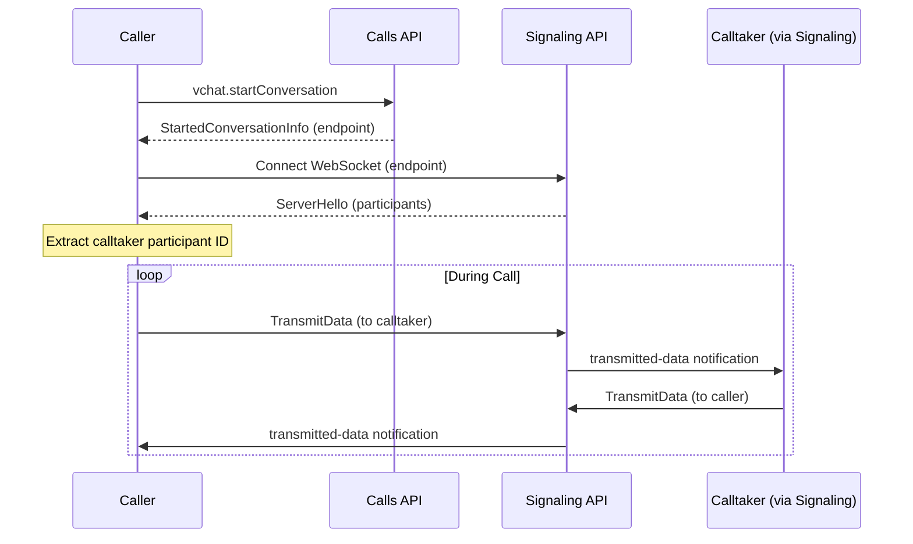
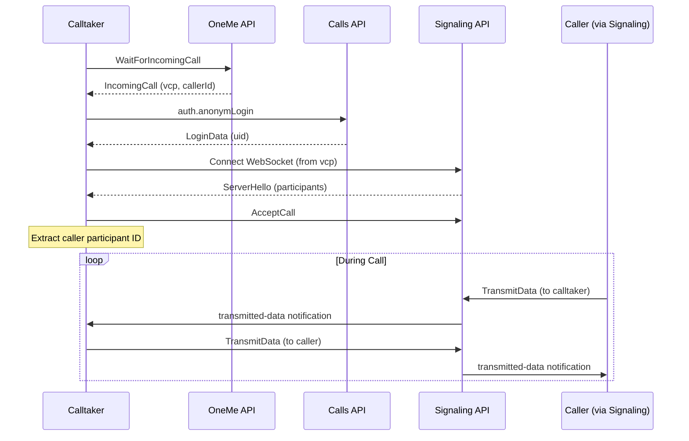

# Signaling API Documentation

## Table of Contents

- [Overview](#overview)
- [Connection](#connection)
  - [WebSocket Connection](#websocket-connection)
  - [Connection Parameters](#connection-parameters)
  - [Required Headers](#required-headers)
  - [Connection for Outgoing Calls](#connection-for-outgoing-calls)
  - [Connection for Incoming Calls](#connection-for-incoming-calls)
- [Message Types](#message-types)
  - [ServerHello](#serverhello)
  - [AcceptCall](#acceptcall)
  - [TransmitData](#transmitdata)
  - [transmitted-data Notification](#transmitted-data-notification)
  - [Ping/Pong](#pingpong)
- [Complete Workflows](#complete-workflows)
  - [Outgoing Call Flow (Caller)](#outgoing-call-flow-caller)
  - [Incoming Call Flow (Calltaker)](#incoming-call-flow-calltaker)
- [Participant ID Mapping](#participant-id-mapping)
  - [Finding Participant IDs](#finding-participant-ids)
- [Message Processing](#message-processing)
  - [Message Filtering](#message-filtering)
  - [Sequence Number Management](#sequence-number-management)
- [Error Handling](#error-handling)
  - [Connection Errors](#connection-errors)
  - [Invalid Messages](#invalid-messages)
  - [Common Issues](#common-issues)
- [Notes](#notes)

## Overview

The Signaling API is a WebSocket-based service used for real-time call signaling during active calls. It handles call acceptance, user identification, and data transmission between call participants.

**Endpoint:** Dynamic (provided by Calls API or OneMe API)

The signaling server endpoint is dynamically provided:
- For **outgoing calls**: Provided in the `endpoint` field from `vchat.startConversation` response
- For **incoming calls**: Extracted from the decoded `vcp` field in `IncomingCall` message

## Connection

### WebSocket Connection

The Signaling API uses WebSocket connections for bidirectional communication. The endpoint URL includes query parameters that must be preserved.

### Connection Parameters

When connecting to the signaling server, the following query parameters are automatically appended:

| Parameter | Value | Description |
|-----------|-------|-------------|
| `platform` | `WEB` | Platform identifier |
| `appVersion` | `1.1` | Application version |
| `version` | `5` | Protocol version |
| `device` | `browser` | Device type |
| `capabilities` | `603F` | Client capabilities |
| `clientType` | `ONE_ME` | Client type identifier |
| `tgt` | `start` | Target/action identifier |

### Required Headers

- **Origin:** `https://web.max.ru` (required for WebSocket connection)

### Connection for Outgoing Calls

For outgoing calls, the endpoint is provided directly from the Calls API:

```
wss://signaling-server.example.com/websocket?userId=123456789&entityType=USER&conversationId=550e8400-e29b-41d4-a716-446655440000&token=signaling_token_xyz&platform=WEB&appVersion=1.1&version=5&device=browser&capabilities=603F&clientType=ONE_ME&tgt=start
```

### Connection for Incoming Calls

For incoming calls, extract the signaling server URL from the decoded `vcp` field:

1. Decode the `vcp` field from `IncomingCall` message
2. Extract `wse` field (signaling server URL)
3. Construct connection URL with query parameters:
   - `userId`: From `LoginData.UID`
   - `entityType`: `USER`
   - `conversationId`: From `IncomingCall.ConversationID`
   - `token`: From decoded `vcp.tkn`

Example:
```
wss://signaling-server.example.com/websocket?userId=123456789&entityType=USER&conversationId=550e8400-e29b-41d4-a716-446655440000&token=signaling_token_xyz&platform=WEB&appVersion=1.1&version=5&device=browser&capabilities=603F&clientType=ONE_ME&tgt=start
```

## Message Types

### ServerHello

The first message received after establishing the WebSocket connection. Contains conversation and participant information.

**Message Format:**

```json
{
  "conversation": {
    "participants": [
      {
        "externalId": {
          "id": "987654321"
        },
        "id": 12345
      },
      {
        "externalId": {
          "id": "123456789"
        },
        "id": 67890
      }
    ]
  }
}
```

**Fields:**

| Field | Type | Description |
|-------|------|-------------|
| `conversation.participants` | array | List of call participants |
| `conversation.participants[].externalId.id` | string | External user ID (from Calls API) |
| `conversation.participants[].id` | integer | Internal participant ID (used for data transmission) |

**Usage:**

- Extract participant IDs from this message
- Map external user IDs to internal participant IDs
- Use internal participant IDs when sending `TransmitData` messages

**Example:**

```json
{
  "conversation": {
    "participants": [
      {
        "externalId": {
          "id": "987654321"
        },
        "id": 12345
      },
      {
        "externalId": {
          "id": "123456789"
        },
        "id": 67890
      }
    ]
  }
}
```

In this example:
- External ID `"987654321"` maps to internal ID `12345`
- External ID `"123456789"` maps to internal ID `67890`

---

### AcceptCall

Send this message to accept an incoming call. Only used by the call recipient (calltaker).

**Message Format:**

```json
{
  "command": "accept-call",
  "sequence": 1,
  "mediaSettings": {
    "isAudioEnabled": true,
    "isVideoEnabled": false,
    "isScreenSharingEnabled": false,
    "isFastScreenSharingEnabled": false,
    "isAudioSharingEnabled": false,
    "isAnimojiEnabled": false
  }
}
```

**Fields:**

| Field | Type | Required | Description |
|-------|------|----------|-------------|
| `command` | string | Yes | Must be `"accept-call"` |
| `sequence` | integer | Yes | Sequence number (starts at 1, increments for each message) |
| `mediaSettings` | object | Yes | Media settings configuration |
| `mediaSettings.isAudioEnabled` | boolean | Yes | Enable audio |
| `mediaSettings.isVideoEnabled` | boolean | Yes | Enable video |
| `mediaSettings.isScreenSharingEnabled` | boolean | Yes | Enable screen sharing |
| `mediaSettings.isFastScreenSharingEnabled` | boolean | Yes | Enable fast screen sharing |
| `mediaSettings.isAudioSharingEnabled` | boolean | Yes | Enable audio sharing |
| `mediaSettings.isAnimojiEnabled` | boolean | Yes | Enable animoji |

**Sequence Numbers:**

- Sequence numbers start at `1` for the first message after `ServerHello`
- Each subsequent message increments the sequence number
- Sequence numbers are used for message ordering and tracking

**Example:**

```json
{
  "command": "accept-call",
  "sequence": 1,
  "mediaSettings": {
    "isAudioEnabled": true,
    "isVideoEnabled": false,
    "isScreenSharingEnabled": false,
    "isFastScreenSharingEnabled": false,
    "isAudioSharingEnabled": false,
    "isAnimojiEnabled": false
  }
}
```

---

### TransmitData

Send data to another participant during an active call. Used for custom data transmission between call participants.

**Message Format:**

```json
{
  "command": "transmit-data",
  "sequence": 2,
  "participantId": 12345,
  "data": "any_data_here",
  "participantType": "USER"
}
```

**Fields:**

| Field | Type | Required | Description |
|-------|------|----------|-------------|
| `command` | string | Yes | Must be `"transmit-data"` |
| `sequence` | integer | Yes | Sequence number (increments for each message) |
| `participantId` | integer | Yes | Internal participant ID of the recipient (from `ServerHello`) |
| `data` | any | Yes | Data to transmit (can be string, number, object, etc.) |
| `participantType` | string | Yes | Participant type (always `"USER"`) |

**Participant ID:**

- Use the internal participant ID from `ServerHello`
- Find the participant ID by matching external user ID
- For outgoing calls: use the calltaker's internal ID
- For incoming calls: use the caller's internal ID

**Example:**

```json
{
  "command": "transmit-data",
  "sequence": 2,
  "participantId": 12345,
  "data": "Hello from caller!",
  "participantType": "USER"
}
```

**Example with JSON data:**

```json
{
  "command": "transmit-data",
  "sequence": 3,
  "participantId": 12345,
  "data": {
    "type": "custom_message",
    "content": "Custom data payload",
    "timestamp": 1234567890
  },
  "participantType": "USER"
}
```

---

### transmitted-data Notification

Receive data from another participant during an active call.

**Message Format:**

```json
{
  "type": "notification",
  "notification": "transmitted-data",
  "data": "received_data_here"
}
```

**Fields:**

| Field | Type | Description |
|-------|------|-------------|
| `type` | string | Message type (always `"notification"`) |
| `notification` | string | Notification type (always `"transmitted-data"`) |
| `data` | any | Received data (can be string, number, object, etc.) |

**Filtering:**

Only process messages where:
- `type` equals `"notification"`
- `notification` equals `"transmitted-data"`

Ignore all other message types.

**Example:**

```json
{
  "type": "notification",
  "notification": "transmitted-data",
  "data": "Hello from calltaker!"
}
```

**Example with JSON data:**

```json
{
  "type": "notification",
  "notification": "transmitted-data",
  "data": {
    "type": "custom_message",
    "content": "Custom data payload",
    "timestamp": 1234567890
  }
}
```

---

### Ping/Pong

The signaling server uses a ping/pong heartbeat mechanism to keep the connection alive.

**Ping Message:**

The server sends a ping as a raw byte message: `ping`

**Pong Response:**

The client must respond immediately with: `pong`

**Implementation:**

```javascript
websocket.on('message', (data) => {
  if (data === Buffer.from('ping')) {
    websocket.send(Buffer.from('pong'));
    return;
  }
  // Process other messages...
});
```

## Complete Workflows

### Outgoing Call Flow (Caller)



**Step-by-step:**

1. **Start conversation** via Calls API to get signaling endpoint
2. **Connect** to signaling server using the endpoint URL
3. **Receive ServerHello** and extract participant IDs
4. **Find calltaker's internal ID** by matching external user ID
5. **Send/receive data** using `TransmitData` and `transmitted-data` notifications
6. **Handle ping/pong** to keep connection alive

### Incoming Call Flow (Calltaker)



**Step-by-step:**

1. **Wait for incoming call** via OneMe API
2. **Decode vcp** to extract signaling server URL and token
3. **Authenticate** with Calls API to get `uid`
4. **Connect** to signaling server using decoded URL and token
5. **Receive ServerHello** and extract participant IDs
6. **Send AcceptCall** to accept the incoming call
7. **Find caller's internal ID** by matching external user ID from `IncomingCall.callerId`
8. **Send/receive data** using `TransmitData` and `transmitted-data` notifications
9. **Handle ping/pong** to keep connection alive

## Participant ID Mapping

### Finding Participant IDs

After receiving `ServerHello`, you need to map external user IDs to internal participant IDs:

**For Outgoing Calls:**
- You know the calltaker's external ID (provided when starting conversation)
- Find the participant in `ServerHello` where `externalId.id` matches the calltaker's external ID
- Use that participant's `id` field as the `participantId` in `TransmitData`

**For Incoming Calls:**
- You know the caller's external ID from `IncomingCall.callerId`
- Find the participant in `ServerHello` where `externalId.id` matches the caller's external ID
- Use that participant's `id` field as the `participantId` in `TransmitData`

**Example Mapping Function:**

```javascript
function findParticipantId(serverHello, externalUserId) {
  for (const participant of serverHello.conversation.participants) {
    if (participant.externalId.id === externalUserId) {
      return participant.id;
    }
  }
  throw new Error('Participant not found');
}

// Usage for outgoing call
const calltakerExternalId = "987654321";
const calltakerInternalId = findParticipantId(serverHello, calltakerExternalId);

// Usage for incoming call
const callerExternalId = String(incomingCall.callerId);
const callerInternalId = findParticipantId(serverHello, callerExternalId);
```

## Message Processing

### Message Filtering

When reading messages from the WebSocket:

1. **Check for ping**: If message is `"ping"` (byte string), respond with `"pong"` and continue
2. **Parse JSON**: Parse the message as JSON
3. **Check type**: If `type === "notification"` and `notification === "transmitted-data"`, process the data
4. **Ignore other messages**: Filter out any other message types

### Sequence Number Management

- Start sequence at `1` after `ServerHello`
- Increment sequence for each `TransmitData` or `AcceptCall` message
- Sequence numbers are independent per connection
- Use sequence numbers for message ordering and debugging

